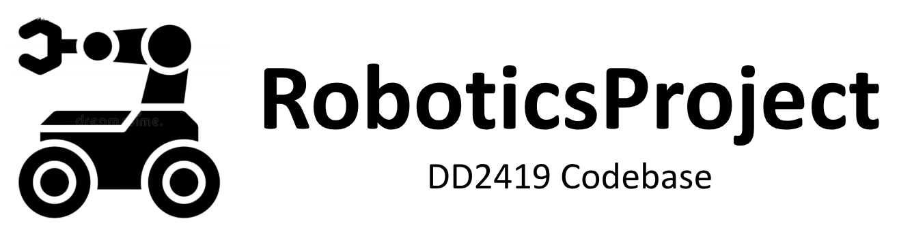

    <a href="https://github.com/bingxue-xu/robp_workshop">
    <picture>
    
    </picture> 
    </a>

  
  
  

Play with my little mobile robot by branch:

- **[`dd2419`](../../tree/dd2419) — Recycling Robot Project**  
  Full autonomous robot stack developed for the DD2419 course.  
  `[Mapping]` `[Localization]` `[A* Path Planning]` `[Pure Pursuit]` `[Object Detection]` `[6-DOF Arm Manipulation]`  → [here](assets/readmes/README_dd2419.md)
  
  

- **[`workshop`](../../tree/workshop) — Line Following Workshop**  
  Real-time HSV color detection driving a proportional controller.  
  `[RealSense D435]` `[Perception]` `[Controller]` → [here](assets/readmes/README_workshop.md)

  

- **[`hardware`](../../tree/hardware) — Hardware Testing**  
  Test suite and odometry calibration across all robot components.  
  `[Odometry Calibration]` `[Encoder]` `[RPLidar]` `[RealSense]` `[xArm]` `[Phidgets]` → [here](assets/readmes/README_hardware.md)

---

## Gallery

**Toolkits** — reset servo ID using ESP32, reset Hiwonder-xArm initial position [`hardware_test/tools`]

**Packages** — `perception` · `controller` · `odometry` · `display_markers` · `line_follower` · `hardware_test` · `robp_robot` · `robp_boot_camp`
