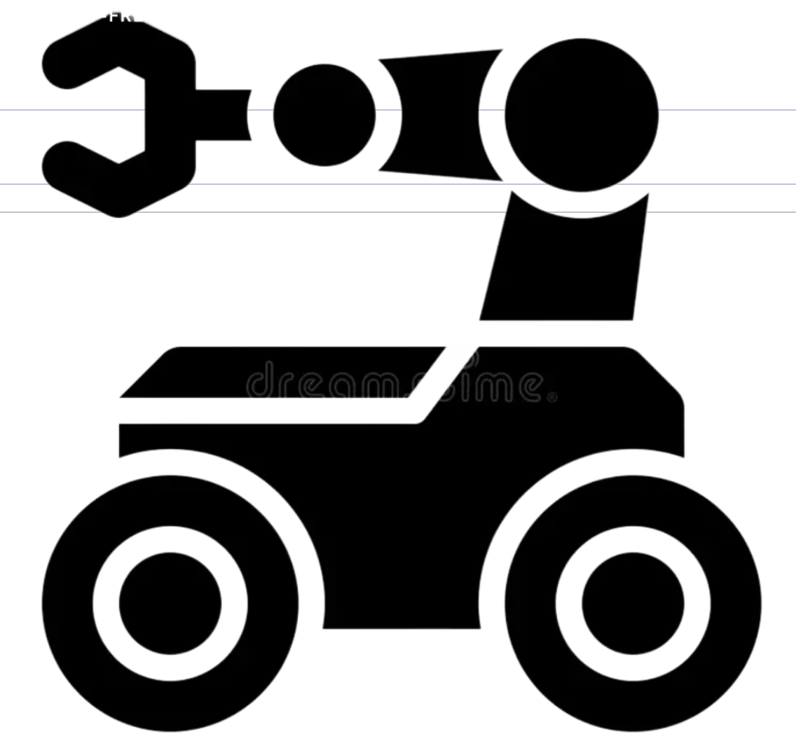

<p align="center">
    <a href="https://github.com/bingxue-xu/robp_workshop">
    <picture>
    
    </picture><br>
    </a>
</p>

<p align="center">
  
  
  
</p>

Implementation of the following projects:

- **Autonomous Line Following Workshop**  
  Real-time HSV color detection driving a proportional controller.
  [ RealSense D435 ] [ Controller ] → [here](#workshop)

- **Hardware Test Suite**  
  Test tuite for component across LiDAR, camera, 6-DOF arm, and controller in a single launch.
  [ RPLidar ] [ RealSense ] [ xArm ] [ Phidgets ] → [here](#hardware-test-suite)

- **Odometry Test Procedure**  
  UMBmark bidirectional square-path odometry test procedure, achieved up to 67% lower systemetic error after calibration.
  [ Encoders ] [ TF2 ] [ Odometry ] → [here](#odometry-calibration)

---

## Workshop

https://github.com/user-attachments/assets/d388093e-836f-4a35-9250-5bd22cd0b9b2

The robot navigates a colored-tape course using only its onboard camera. An HSV filter isolates the line and a proportional controller converts pixel offset to wheel velocity commands published on `/cmd_vel`.

---

## Hardware Test Suite

One launch file runs all checks and saves timestamped JSON results per robot, then renders the table below.

| Robot   | Encoders / IMU | RPLidar               | RealSense     | Arm (6 servos) |
|---------|----------------|-----------------------|---------------|----------------|
| Bashful | ✅             | ✅ 360 pts · 5.12 m   | ✅ 1280×720   | ✅ 6 / 6       |
| Sneezy  | ✅             | ✅ 360 pts · 4.81 m   | ✅ 1280×720   | ✅ 6 / 6       |
| Sweety  | ✅             | ✅ 360 pts · 5.39 m   | ✅ 640×480    | ✅ 6 / 6       |
| Doc     | ✅             | ✅ 360 pts · 5.10 m   | ✅ 1280×720   | ✅ 6 / 6       |
| Sleepy  | ✅             | —                     | ✅ 1280×720   | ❌ 1 / 6       |

---

## Odometry Calibration

UMBmark method: the robot drives a 1 m × 1 m square CW and CCW for N laps. Encoder-based dead-reckoning is compared against ground-truth TF transforms to compute correction factors for wheel radius and baseline. Results are saved to `summary.csv` with per-run error plots.

---

## 0. Installation

```bash
# ROS2 Jazzy → https://docs.ros.org/en/jazzy/Installation/Ubuntu-Install-Debians.html
sudo apt install ros-jazzy-kobuki-ros-interfaces sshpass

git clone https://github.com/bingxue-xu/robp_workshop.git ~/workshop_ws/src
cd ~/workshop_ws
rosdep install --from-paths src -y --ignore-src --as-root pip:false
colcon build --symlink-install

source /opt/ros/jazzy/setup.bash
source ~/workshop_ws/install/local_setup.bash
```

## 1. Quick Start

**Workshop**
```bash
# Simulation
ros2 launch robp_boot_camp_launch workshop_sim_launch.xml

# Real robot
ros2 launch robp_boot_camp_launch workshop_launch.xml
```

**Hardware testing**
```bash
ros2 launch hardware_test hardware_checks_launch.launch.py robot_name:=Bashful domain_id:=1
```

**Odometry calibration**
```bash
ros2 launch hardware_test odometry_test_launch.launch.py robot_name:=Bashful domain_id:=1
```

## 2. Gallery

**Tools** — ESP32 servo ID reset utility (used when the official debugging board is unavailable): [`hardware_test/tools/servo_setter`](hardware_test/tools/servo_setter)

**Packages** — `perception` · `controller` · `odometry` · `icp_odometry` · `display_markers` · `line_follower` · `hardware_test` · `robp_robot` · `robp_boot_camp`
