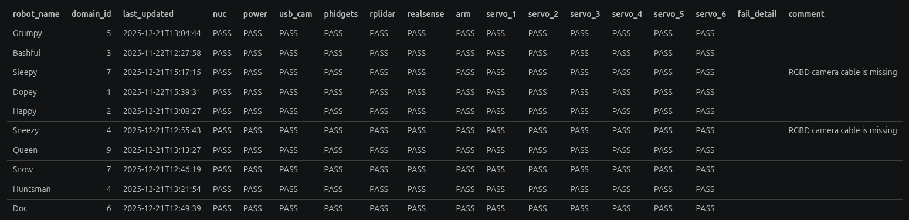
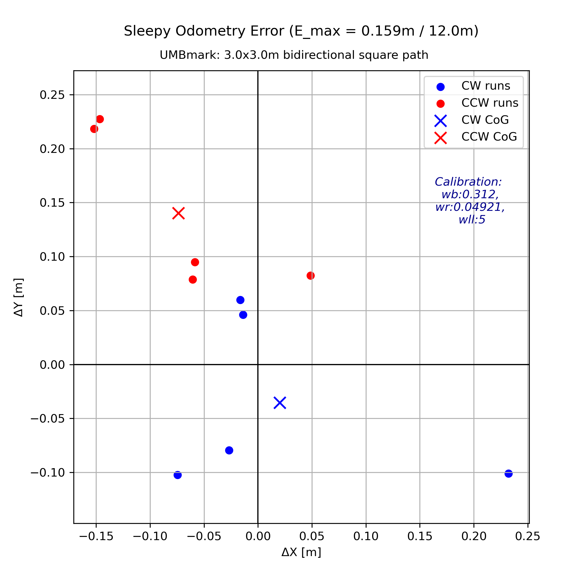

    <a href="https://github.com/bingxue-xu/RoboticsProject">
    <picture>
    
    </picture> 
    </a>

  
  
  

📦 **Developed Packages** — `perception`, `slam`, `path_planning`, `pure_pursuit`, `controller`,`manipulator`, `odometry`, `display_markers`, `line_follower`, `hardware_test`, `behavior_tree`, `speaker` 

### 🤖 Play with my little mobile robot by branch

- **branch [`dd2419`](../../tree/dd2419) — Recycling Robot Project**  
  Full autonomous robot stack developed for the DD2419 project course.  
  `[Mapping]` `[Localization]` `[A* Path Planning]` `[Pure Pursuit]` `[Object Detection]` `[6-DOF Arm Manipulation]` `[Behavior Tree]``[System Integration]` → [README here](assets/readmes/README_dd2419.md)
  
  <video src="https://github.com/user-attachments/assets/afc56a17-66b4-413e-8303-072bbf07dd24" controls width="600"></video>

- **branch [`workshop`](../../tree/workshop) — Line Following Workshop**  
  Real-time HSV color detection driving a proportional controller.  
  `[RealSense D435]` `[Perception]` `[Controller]` → [README here](assets/readmes/README_workshop.md)

  <video src="https://github.com/user-attachments/assets/d388093e-836f-4a35-9250-5bd22cd0b9b2" controls width="600"></video>

- **branch [`hardware`](../../tree/hardware) — Hardware Testing**  
  Test suite and odometry calibration across all robot components for ten robots.  
  `[Odometry Calibration]` `[Encoder]` `[RPLidar]` `[RealSense]` `[xArm]` `[Phidgets]` → [README here](assets/readmes/README_hardware.md)
  **Hardware summary**
  

    <picture>
    
    </picture> 
    </a>
  

  **Odometry Calibration — Example**

  | Before | After |
  |:---:|:---:|
  |  |  |

  **Toolkits** — reset servo ID using ESP32, reset Hiwonder-xArm initial position [`hardware_test/tools`]

---

