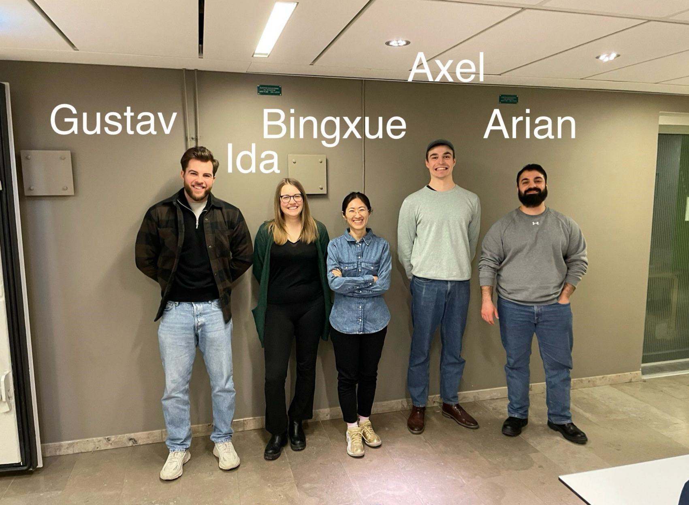

We as **Group4**, developed our full autonomous robot stack for the DD2419 project course.

  
  
  

  `[Mapping]` `[Localization]` `[A* Path Planning]` `[Pure Pursuit]` `[Object Detection]` `[6-DOF Arm Manipulation]` `[Behavior Tree]``[System Integration]`

#################		Commands For The Robot			###################

################# For tips and debugging check USEFUL COMMANDS		###################

## Run The Robot ##
ros2 launch start_robot_package start_robot_launch.xml

## Run Simulation ##
ros2 launch start_robot_package simulate_launch.xml

## Control the robot
ros2 run teleop_twist_keyboard teleop_twist_keyboard 
ros2 run controller cartesian_controller 
ros2 run odometry odometry

## Run Lidar node

ros2 run laser_scan_transformer laser_to_map

## Record a rosbag

ros2 bag record:
ros2 bag record /motor/current_duty_cycles /motor/duty_cycles /motor/encoders /path /tf /tf_static /scan /imu/data_raw -o SLAMBAG

MILESTON2:

ros2 run path_planning global planning
ros2 run manipulator pick_up service
ros2 run detection detection
ros2 run pure pursuit pure puresuit
ros2 run state maching ms2

#Check SLAM ODOM that use encoders is FALSE/TRUE

**Sneezy's Final Show **  
  <video src="https://github.com/user-attachments/assets/afc56a17-66b4-413e-8303-072bbf07dd24" controls width="600"></video>

