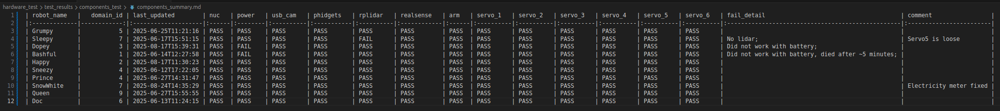
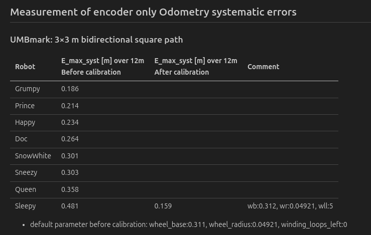
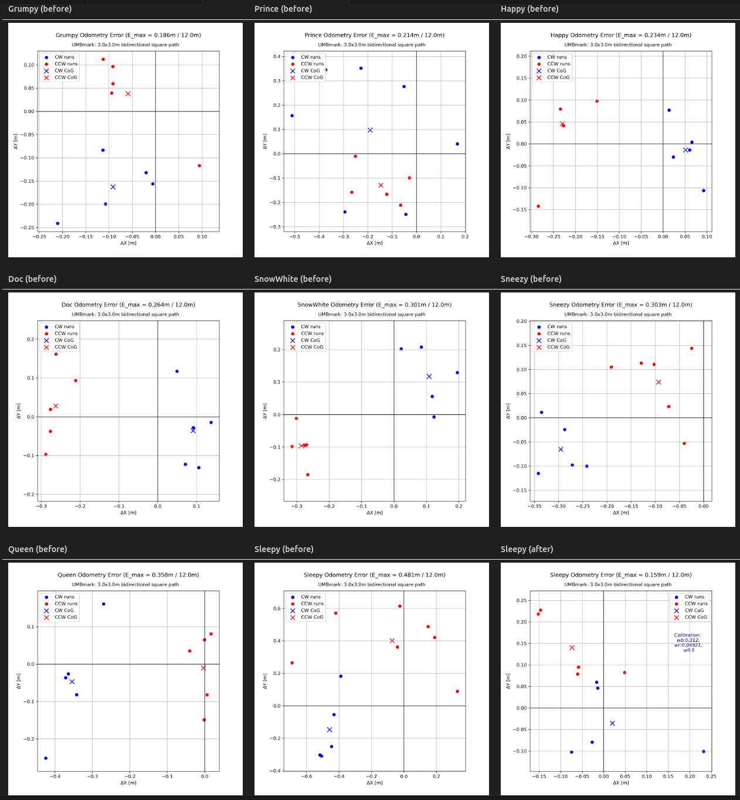

## Run hardware test
This will check if all your robot components are working properly.

```bash
# Terminal 1: Start micro-ROS agent 
ros2 run micro_ros_agent micro_ros_agent serial --dev /dev/hiwonder_arm -v6

# Terminal 2: Launch test
# Set domain ID for current terminal session
export ROS_DOMAIN_ID=0
ros2 launch hardware_test hardware_checks_launch.launch.py robot_name:=Sneezy domain_id:=0

# Summary components results
cd /home/bingxue/dd2419/workshop_ws/src

python3 hardware_test/hardware_test/utils/components_sum.py hardware_test/test_results/components_test --save-dir hardware_test/test_results/summary
```

Check the results here: [Components Summary](test_results/summary/components_summary.md)


## Run Odometry test 
This measures how accurately your robot's odometry using wheel encoders.


```bash
# Terminal 1: Start odometry system
ros2 launch hardware_test odometry_test_launch.launch.py robot_name:=Sneezy json_folder:=hardware_test/test_results/odometry_test

# Terminal 2: Run test
ros2 run hardware_test odometry_test --ros-args -p robot_name:=Sneezy -p domain_id:=0 -p direction:=ccw -p square_size:=3.0 -p lap:=4 -p angular_speed:=1.2

# After each run, input measurement:
Enter measured x_abs [m]: 1.75
Enter measured y_abs [m]: -0.785
Enter measured theta_abs [deg] (optional, Enter to skip): 

# results saved
[INFO] [1755056587.144777617] [umbmark_odometry_test]: Saved lap 4 ccw → /home/bingxue/dd2419/workshop_ws/src/hardware_test/test_results/odometry_test/Sneezy_umbmark.json

# Repeat for all 5 laps counter-clockwise(ccw) and clockwise(cw)

# Analysis and plot results
cd /home/bingxue/dd2419/workshop_ws/src

python3 hardware_test/hardware_test/utils/umbmark_analysis.py hardware_test/test_results/odometry_test/Sneezy_umbmark.json  --save-dir hardware_test/test_results/odometry_test/

# summary odometry results
python3 hardware_test/hardware_test/utils/umbmark_sum.py hardware_test/test_results/odometry_test/ --save-dir /home/bingxue/dd2419/workshop_ws/src/hardware_test/test_results/summary/odometry_summary.md
```
Check the results here: [Odometry Summary](test_results/summary/odometry_summary.md)





## Tools

### Servo ID Setter
Need to replace arm servos but don't have a debug board? Use your ESP32

**README:** [Set servo ID with ESP32](hardware_test/hardware_test/tools/servo_setter/README.md)
