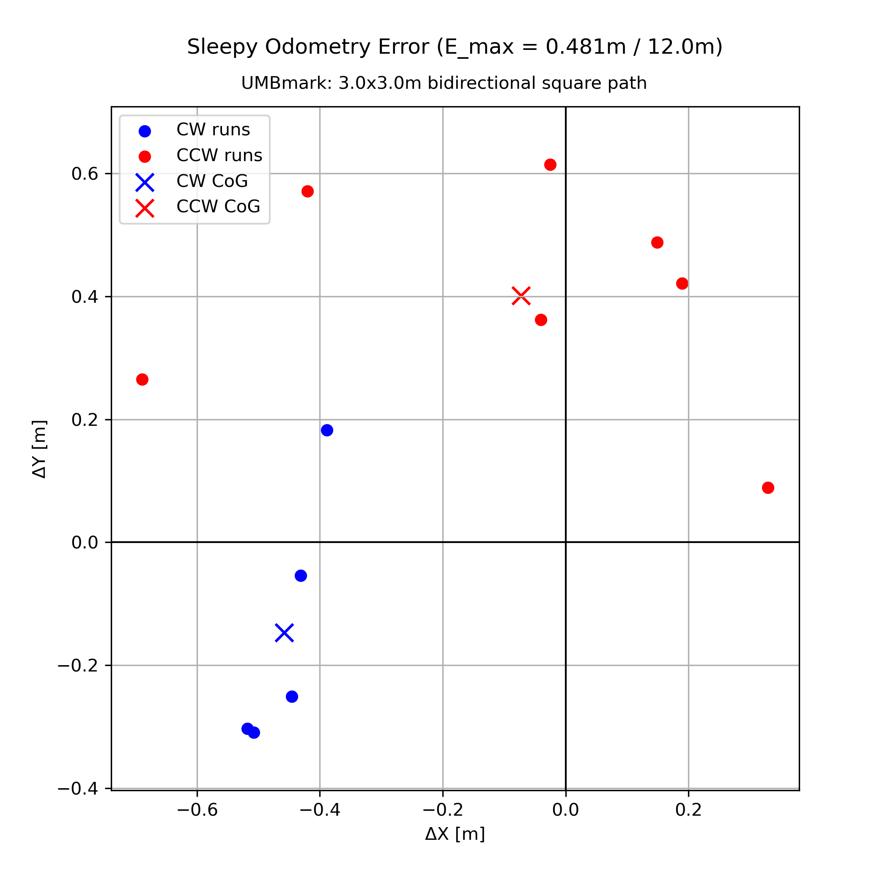

## Measurement of encoder only Odometry systematic errors

### UMBmark: 3×3 m bidirectional square path

| Robot | E_max_syst [m] over 12m   Before calibration | E_max_syst [m] over 12m   After calibration | Comment |
|-------|-----------------------------------------------|----------------------------------------------|---------|
| Grumpy | 0.186 |  |  |
| Prince | 0.214 |  |  |
| Happy | 0.234 |  |  |
| Doc | 0.264 |  |  |
| SnowWhite | 0.301 |  |  |
| Sneezy | 0.303 |  |  |
| Queen | 0.358 |  |  |
| Sleepy | 0.481 | 0.159 | wb:0.312, wr:0.04921, wll:5 |

* default parameter before calibration: wheel_base:0.311, wheel_radius:0.04921, winding_loops_left:0

### Odometry Error Plots

| Grumpy (before) | Prince (before) | Happy (before) |
|---|---|---|
|  |  |  | 

| Doc (before) | SnowWhite (before) | Sneezy (before) |
|---|---|---|
|  |  |  | 

| Queen (before) | Sleepy (before) | Sleepy (after) |
|---|---|---|
|  |  |  | 

