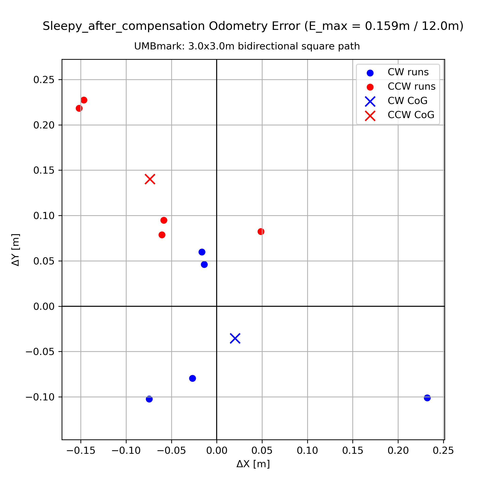

## Measurement of encoder only Odometry systematic errors

### UMBmark: 3×3 m bidirectional square path

| Robot | E_max_syst [m] over 12m |
|-------|------------------------|
| Sleepy_after_compensation | 0.159 |
| Grumpy | 0.186 |
| Prince | 0.214 |
| Happy | 0.234 |
| Doc | 0.264 |
| SnowWhite | 0.301 |
| Sneezy | 0.303 |
| Queen | 0.358 |
| Sleepy_before_compensation | 0.481 |

### Odometry Error Plots

| Sleepy_after_compensation | Grumpy | Prince |
|---|---|---|
|  |  |  | 

| Happy | Doc | SnowWhite |
|---|---|---|
|  |  |  | 

| Sneezy | Queen | Sleepy_before_compensation |
|---|---|---|
|  |  |  | 

